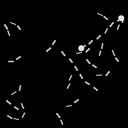
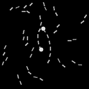
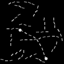
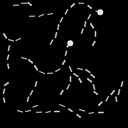
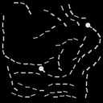
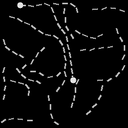

# Pathfinder

| Difficulty | Connected Example | Disconnected Example |
|------------|-------------------|----------------------|
| Easy       |  |  |
| Normal     |  |  |
| Hard       |  |  |

The task `Pathfinder` is a image binary classification task.
Each input image will contain two bright dots (endpoints), and the task is to determine if the two dots are connected by dotted lines.
The above table shows the three difficulty levels (by the length of the lines presented in the image) along with a positive (connected) and a negative (disconnected) example.

## Scallop Program

The scallop program for this task is a simple transitive closure:

``` scl
type edge(usize, usize)
type is_endpoint(usize)

rel path(x, y) = edge(x, y)
rel path(x, z) = path(x, y), edge(y, z)

rel is_connected() = is_endpoint(x), is_endpoint(y), path(x, y)
```

## Experiment

To run this experiment, please make sure that you have the `pathfinder` dataset downloaded from (TODO).
The folder structure should look like

```
[SCALLOP_V2_DIR]/experiments/data/
> pathfinder128/
  > curv_baseline/
    > imgs/
      > 0/
        > sample_0.png
        > ...
      > ...
    > metadata/
      > 0.npy
      > 1.npy
      > ...
  > curv_contour_length_9/
  > curv_contour_length_14/
```

Then run

``` scl
$ python run_with_cnn.py
```
